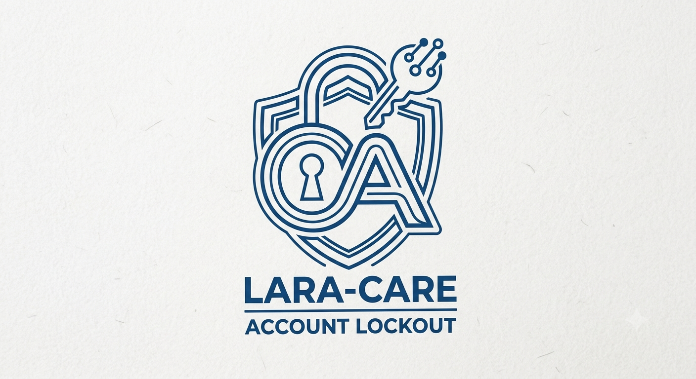

# Lara-Care: Account Lockout

<p align="center">
  
</p>

<p align="center">
  <a href="https://packagist.org/packages/lara-care/account-lockout"></a>
  <a href="https://github.com/lara-care/account-lockout/actions"></a>
  <a href="https://packagist.org/packages/lara-care/account-lockout"></a>
  <a href="https://packagist.org/packages/lara-care/account-lockout"></a>
</p>

---

**`lara-care/account-lockout`** is an intelligent security package for Laravel applications. It provides automated attempt tracking, progressive cooldown penalties for repeat offenders, signed URL self-recovery options, and rich domain events out of the box.

Part of the **[Lara-Care](https://github.com/lara-care)** developer toolsuite.

---

## Features

* **Automatic Auth Event Hooking:** Listens directly to Laravel's native authentication events without boilerplate.
* **Progressive Cooldown Penalties:** Escalates lockout duration dynamically for repeat brute-force attempts (e.g., 15 mins → 1 hour → 24 hours).
* **Flexible Tracking Strategies:** Track security thresholds by User Record, IP Address, or a hybrid of both.
* **Self-Service signed URL Recovery:** Generates secure, temporary signed links allowing users to unlock their accounts via email.
* **Extensible Event System:** Dispatches clean events (`AccountLocked`, `AccountUnlocked`, `FailedLoginAttempt`) for easy logging, Slack alerts, or SIEM integration.

---

## Architecture Overview

```
+------------------+      Failed      +---------------------+      Threshold      +-------------------+
| Auth Controller  | ---------------> | AccountLockout Hook | ------------------> | User Locked State |
+------------------+                  +---------------------+      Exceeded       +-------------------+
                                                 |                                          |
                                                 v                                          v
                                      +---------------------+                     +-------------------+
                                      | Attempts Tracking   |                     | Send Magic Link / |
                                      | (User ID / IP)      |                     | Cooldown Timer    |
                                      +---------------------+                     +-------------------+
```

---

## Installation

Install the package via Composer:

```bash
composer require lara-care/account-lockout
```

Publish and run the database migrations:

```bash
php artisan vendor:publish --tag="lara-care-lockout-migrations"
php artisan migrate
```

*(Optional)* Publish the configuration file:

```bash
php artisan vendor:publish --tag="lara-care-lockout-config"
```

---

## Setup & Basic Usage

### 1. Add Trait to your User Model

Add the `HasAccountLockout` trait to your authenticatable model:

```php
namespace App\Models;

use Illuminate\Foundation\Auth\User as Authenticatable;
use LaraCare\AccountLockout\Concerns\HasAccountLockout;

class User extends Authenticatable
{
    use HasAccountLockout;
}
```

### 2. Protect Routes via Middleware

Add the `EnsureAccountIsNotLocked` middleware to your login routes:

```php
use LaraCare\AccountLockout\Http\Middleware\EnsureAccountIsNotLocked;

Route::post('/login', [AuthController::class, 'store'])
    ->middleware(EnsureAccountIsNotLocked::class);
```

### 3. Model Helpers

```php
// Check lockout status
if ($user->isLockedOut()) {
    $secondsLeft = $user->remainingLockoutTime();
}

// Lock manually
$user->lockAccount(durationInMinutes: 30);

// Unlock manually
$user->unlockAccount();
```

---

## Configuration

Below is the published `config/account-lockout.php` structure:

```php
return [
    /*
    | Maximum failed attempts before lock activation
    */
    'max_attempts' => 5,

    /*
    | Base lockout duration in minutes
    */
    'lockout_duration' => 15,

    /*
    | Progressive penalties for repeat lockouts
    */
    'progressive' => [
        'enabled' => true,
        'penalties' => [
            1 => 15,   // 1st lock: 15 minutes
            2 => 60,   // 2nd lock: 1 hour
            3 => 1440, // 3rd lock: 24 hours
        ],
    ],

    /*
    | Strategy: 'user', 'ip', or 'user_and_ip'
    */
    'track_by' => 'user_and_ip',

    /*
    | Self-service magic link recovery settings
    */
    'unlock_via_email' => true,
    'signed_url_expiration' => 30, // minutes
];
```

---

## Testing

Run tests with PHPUnit/Orchestra Testbench:

```bash
composer test
```

---

## Security Vulnerabilities

If you discover a security vulnerability within this package, please report it directly via email to `security@lara-care.dev`.

---

## License

The MIT License (MIT). Please see [License File](LICENSE.md) for more information.
