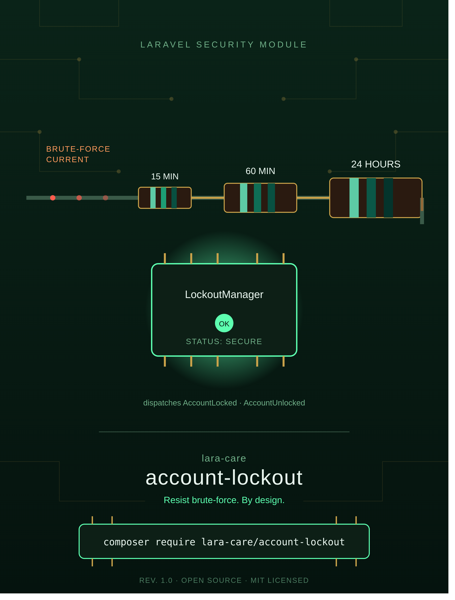

# LaraCare Account Lockout



[](https://packagist.org/packages/lara-care/account-lockout)
[](https://github.com/lara-care/account-lockout/actions)
[](LICENSE.md)

A robust account lockout and progressive cooldown penalty manager for Laravel applications. Protect your authentication routes against brute-force attacks with configurable attempt thresholds, progressive lockouts, and event dispatching.

---

## Features

- 🔒 **Threshold-based Locking:** Temporarily lock accounts or IP addresses after a specified number of failed login attempts.
- ⏱️ **Progressive Cooldowns:** Apply escalating lockout durations for repeat offenders (e.g., 15 mins → 60 mins → 24 hours).
- 📢 **Event Driven:** Dispatches `AccountLocked` and `AccountUnlocked` events for audit logs or notifications.
- 🔔 **Built-in Notifications:** Automatically trigger security alert emails/notifications when lockouts occur.
- 🛠️ **Simple API:** Intuitive interface for recording failed attempts, checking status, and manually unlocking accounts.

---

## Installation

You can install the package via Composer:

```bash
composer require lara-care/account-lockout
```

Publish the configuration file:

```bash
php artisan vendor:publish --tag="account-lockout-config"
```

This will create a `config/account-lockout.php` file in your application root:

```php
return [
    /*
    |--------------------------------------------------------------------------
    | Max Login Attempts
    |--------------------------------------------------------------------------
    |
    | Maximum number of failed attempts allowed before triggering a lockout.
    |
    */
    'max_attempts' => 5,

    /*
    |--------------------------------------------------------------------------
    | Progressive Decay Minutes
    |--------------------------------------------------------------------------
    |
    | Cooldown periods (in minutes) for consecutive lockouts.
    |
    */
    'cooldown_penalties' => [
        1 => 15,  // First lockout: 15 minutes
        2 => 60,  // Second lockout: 60 minutes
        3 => 1440 // Third lockout: 24 hours
    ],
];
```

## Usage

### Recording Failed Attempts & Checking Lockouts

Use the `LockoutManager` service inside your login controllers or authentication actions:

```php
use LaraCare\AccountLockout\Services\LockoutManager;

class LoginController extends Controller
{
    public function login(Request $request, LockoutManager $lockout)
    {
        $user = User::where('email', $request->email)->first();

        // Check if the user is currently locked out
        if ($user && $lockout->isLocked($user)) {
            return response()->json([
                'message' => 'Your account is locked due to multiple failed login attempts.'
            ], 423);
        }

        if (! Auth::attempt($request->only('email', 'password'))) {
            if ($user) {
                // Record the failed attempt
                $lockout->recordFailedAttempt($user, $request->ip());
            }

            return response()->json(['message' => 'Invalid credentials.'], 401);
        }

        // Reset lockout count on successful login
        $lockout->unlock($user);

        return response()->json(['message' => 'Login successful.']);
    }
}
```

## Events

The package fires the following events:

| Event | Description |
|---|---|
| `LaraCare\AccountLockout\Events\AccountLocked` | Dispatched when an account reaches the maximum failed attempts threshold. Contains `$event->user` and `$event->unlocksAt`. |
| `LaraCare\AccountLockout\Events\AccountUnlocked` | Dispatched when an account is manually unlocked or cleared. Contains `$event->user`. |

## Testing

Run the test suite using PHPUnit:

```bash
vendor/bin/phpunit
```

## License

The MIT License (MIT). Please see [License File](LICENSE.md) for more information.